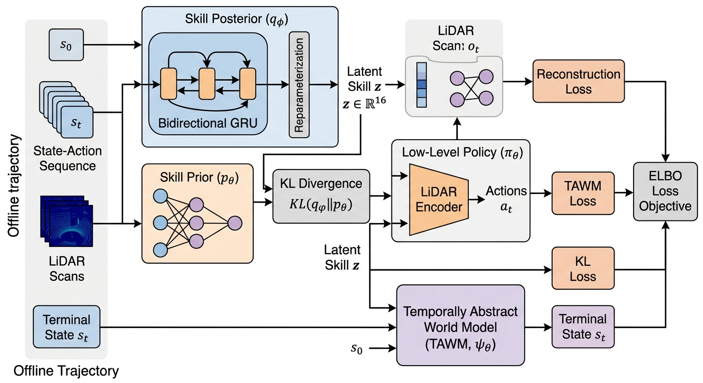
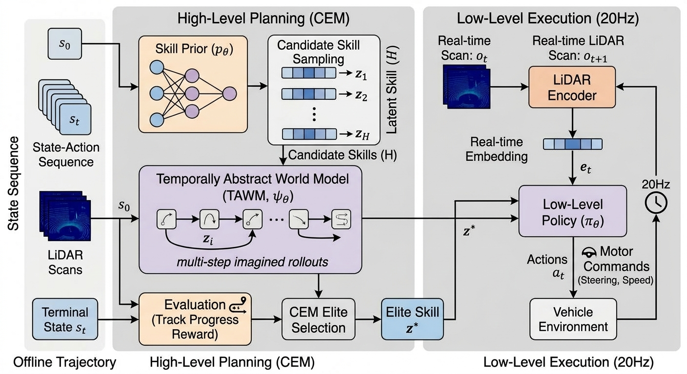
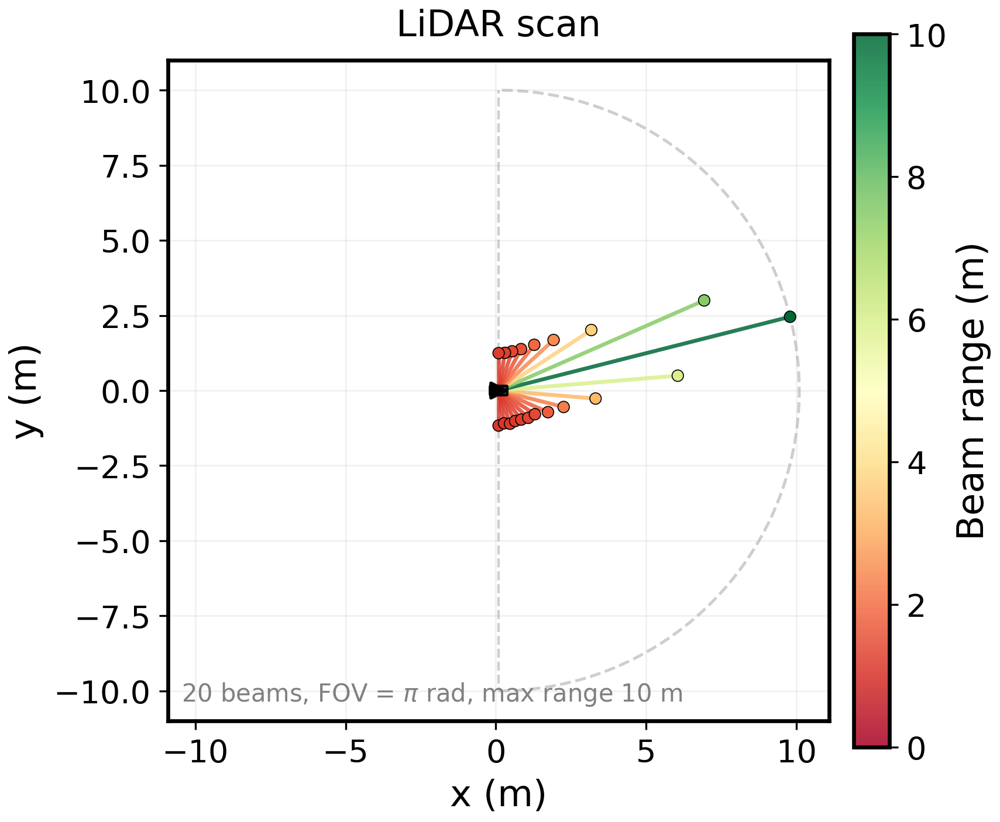
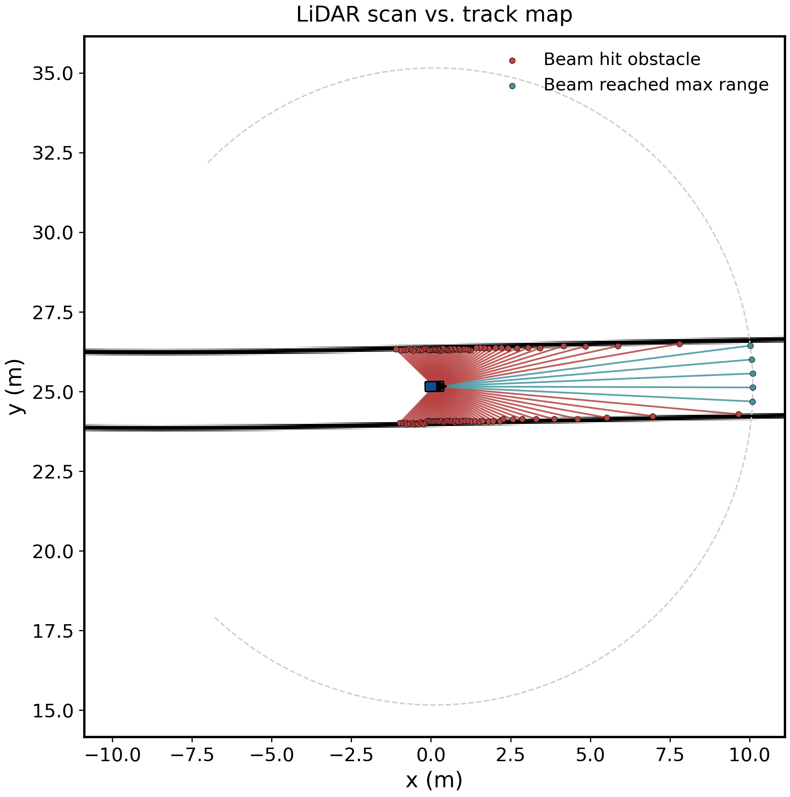
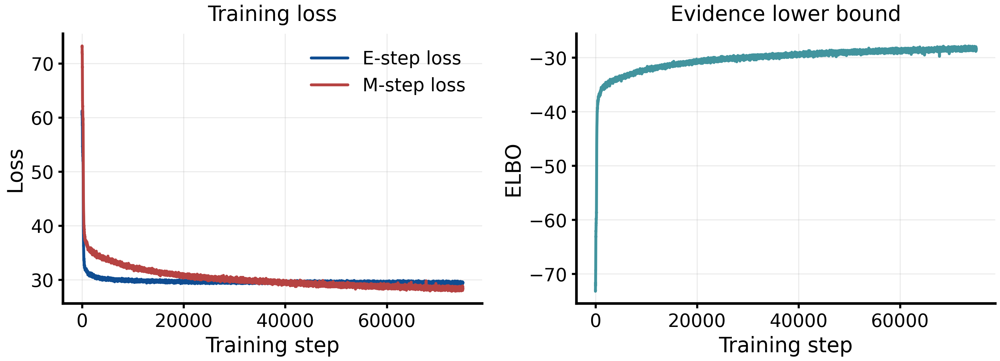
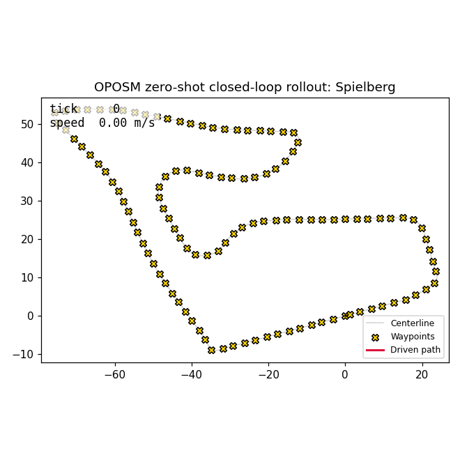
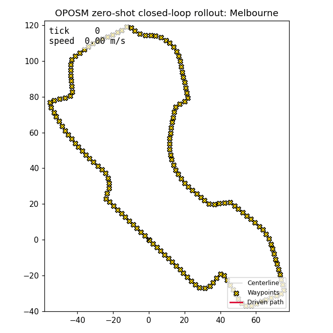

# Dream2Drive

**Dream2Drive: Learning Temporally Abstract World Models for Zero-Shot F1TENTH Racing**

Dream To Drive learns a library of low-level driving *skills* and a **skill-conditioned, temporally abstract world model (TAWM)** entirely from a static, offline dataset of driving logs — no online interaction with the car or the simulator is used during training. Once trained, the world model is used **zero-shot** by a Cross-Entropy Method (CEM) planner to plan full laps on tracks it has never been actively driven on by the learning agent, purely by imagining rollouts in latent skill space.

This repository is a from-scratch re-implementation and adaptation of **OPOSM**, the method introduced in:

> Benjamin Freed, Siddarth Venkatraman, Guillaume Adrien Sartoretti, Jeff Schneider, Howie Choset.
> **"Learning Temporally Abstract World Models without Online Experimentation."**
> *Proceedings of the 40th International Conference on Machine Learning (ICML)*, PMLR 202:10338–10356, 2023.
> [Paper (PMLR PDF)](https://proceedings.mlr.press/v202/freed23a/freed23a.pdf)

adapted and modified for the [F1TENTH](https://www.f1tenth.racing/) 1/10th-scale autonomous racing platform, built on top of the official [`f1tenth_gym`](https://github.com/f1tenth/f1tenth_gym) simulator.

---

## Table of Contents

- [Motivation](#motivation)
- [Method](#method)
- [Adaptations to F1TENTH](#adaptations-to-f1tenth-changes-from-the-original-paper)
- [Architecture](#architecture)
- [Repository Structure](#repository-structure)
- [Installation](#installation)
- [Usage](#usage)
- [Results](#results)
- [Citation](#citation)
- [Acknowledgements](#acknowledgements)
- [License](#license)

---

## Motivation

Real racecars — full-size or F1TENTH-scale — cannot be trained the way most deep RL world models are trained: by letting an untrained policy explore millions of online, exploratory transitions, many of which involve driving off-track, into walls, or at unsafe speeds. Any world model intended to plan **whole laps** for a physical racing platform therefore needs to:

1. Be learned **entirely from logged, offline driving data** (e.g., a demonstration controller, human teleoperation, or existing runs) — never from online trial-and-error.
2. Reason over **extended time horizons** (a full corner, a full straight) rather than single 20 Hz control ticks, so that planning is computationally tractable and numerically stable over a lap-length horizon.
3. Generalize to **new tracks and new goals** without any additional training or fine-tuning.

OPOSM is designed exactly for this setting, which makes it a natural fit for F1TENTH: this project asks *"can we learn to plan a competitive lap on a track the agent has never actively driven, using only a fixed offline log of Pure Pursuit driving on other tracks/speed settings?"*

## Method

At a high level, the model factorizes a driving trajectory into short segments ("skills") and learns four coupled components jointly:

| Component | Role |
|---|---|
| **Skill posterior** `q_φ(z \| τ)` | A bidirectional GRU encoder over a state–action sub-trajectory that infers the latent skill `z` that "explains" it. |
| **Skill prior** `p_ψ(z \| s₀)` | Predicts a prior over skills given only the current state, used for planning/regularization when no future trajectory is known. |
| **Low-level policy** `π_ω(a \| o, z)` | Conditions on the current LiDAR observation embedding and the latent skill `z` and outputs the low-level `[steer, speed]` command at every control tick, so a *single* skill decodes into an entire multi-step action sequence. |
| **Temporally Abstract World Model (TAWM)** `p_θ(s_T \| s₀, z)` | Predicts the *terminal* state reached after executing skill `z` for `T` low-level steps from `s₀` — skipping over the intermediate steps entirely. This is what makes the model *temporally abstract*: planning happens over a handful of skills instead of hundreds of raw control ticks. |

All four networks are trained jointly on offline sub-trajectory windows with an ELBO-style objective (a KL term regularizing the skill posterior toward the skill prior, plus low-level policy and TAWM reconstruction/prediction terms). Two training regimes are implemented and directly compared (see [`training/em_trainer.py`](training/em_trainer.py)):

- **`causal_em`** — an EM-style scheme, faithful to the paper, that alternates an E-step (updating only the skill posterior `φ`) with an M-step (updating the prior, low-level policy, TAWM, and observation encoder `ψ, ω, θ, encoder`), so the world model always regresses against a *frozen* posterior rather than co-adapting with it at every gradient step.
- **`naive_vi`** — a single joint optimizer over all parameters (standard amortized VI), included as an ablation baseline to demonstrate the benefit of the causal EM decomposition.

At test time, [`planning/cem_planner.py`](planning/cem_planner.py) plans directly in the model's latent space: it samples populations of skill sequences, rolls each one forward through the TAWM (no simulator calls), scores the resulting imagined terminal states against a track-progress reward, and iteratively refines the sampling distribution (Cross-Entropy Method) before executing the elite skill sequence — either purely in latent "imagination" or in closed-loop control of the `f1tenth_gym` car.

## Adaptations to F1TENTH (changes from the original paper)

The original paper evaluates OPOSM on simulated locomotion/manipulation benchmarks (e.g., D4RL-style MuJoCo tasks) with low-dimensional proprioceptive states. Porting the method to racing required several deliberate modifications:

- **LiDAR-beam state representation instead of global pose.** The world-model state is built from range-clipped, normalized LiDAR beams (see [`utils/track.py`](utils/track.py), `figures/lidar_beams.png`) rather than raw `(x, y)` coordinates. A global pose is track-specific and would leak map identity into the latent state; a LiDAR-based state generalizes across maps and mirrors what a physical F1TENTH car actually observes. Pose is still computed internally for reward evaluation and control, but it is **not** part of the state given to the skill/world models.
- **Delta-state prediction (`tawm_predict_delta`).** The TAWM optionally predicts the *change* in encoded state induced by a skill rather than the absolute terminal embedding, which stabilizes multi-skill rollouts during planning.
- **Offline data collection via Pure Pursuit, not a fixed expert lap.** [`data/collector.py`](data/collector.py) drives `f1tenth_gym` with a Pure Pursuit controller under randomized target speeds and injected steering/speed noise (`action_noise`, `steer_noise_std`, `speed_noise_std`), so the offline dataset covers a spread of speeds and off-nominal recovery states rather than a single racing line — this is what lets the CEM planner later query the world model outside of the exact demonstrated trajectory.
- **Track-progress CEM reward with hard collision/off-track penalties.** [`planning/reward.py`](planning/reward.py) implements a centerline-arclength progress reward for the CEM planner, with a large terminal penalty for imagined collisions and for leaving the track's drivable half-width, and a milder penalty for backward progress.
- **Causal EM vs. naive VI as a first-class, directly comparable ablation** ([`scripts/evaluate.py`](scripts/evaluate.py)), rather than a single training recipe.
- **A classical kinematic-bicycle MPC baseline** ([`planning/mpc_controller.py`](planning/mpc_controller.py)) implemented alongside the learned planner, so the learned TAWM+CEM pipeline is evaluated head-to-head against a standard model-based racing controller on the same tracks and reward.
- **Direct integration with the official `f1tenth_gym`/`f110_gym` simulator** (vendored under [`f1tenth_gym/`](f1tenth_gym)) for data collection, closed-loop rollout, and rendering, including its GJK-based collision model and ray-casted LiDAR scan simulator.

## Architecture

<p align="center">
  
</p>
<p align="center"><em>Training-time architecture — the skill posterior encodes a sub-trajectory into a latent skill z, which conditions both the low-level policy (reconstructing every action in the window) and the TAWM (predicting the terminal state).</em></p>

<p align="center">
  
</p>
<p align="center"><em>Inference-time planning — the CEM planner samples skill sequences from the skill prior, imagines their outcomes purely through the TAWM, and re-plans in closed loop.</em></p>

<p align="center">
  
  
</p>
<p align="center"><em>Left: the forward-facing LiDAR beam layout used as the world model's state. Right: an example scan overlaid on the track map.</em></p>

<p align="center">
  
</p>
<p align="center"><em>Training loss and ELBO curves over 150 epochs of causal EM training.</em></p>

**Demonstrations:**

<p align="center">
  
  
</p>
<p align="center"><em>Zero-shot, closed-loop laps planned by the CEM planner through the trained TAWM (no online fine-tuning on these tracks).</em></p>


## Repository Structure

```text
├── configs/
│   └── default.yaml         # Single source of truth for data, model, training, and planning hyperparameters
├── data/
│   ├── collector.py         # Pure Pursuit-driven offline data collection in f1tenth_gym
│   ├── dataset.py            # Sub-trajectory windowing / OfflineSkillDataset
│   └── __init__.py
├── envs/
│   └── f1tenth_env.py        # Closed-loop wrapper around f110_gym for policy/planner execution
├── f110_gym/envs/            # Vendored F1TENTH Gym: vehicle dynamics, collision model, LiDAR scan sim, rendering
├── figures/                  # Diagrams, LiDAR visualizations, training curves
├── models/
│   ├── networks.py           # SkillPosterior, SkillPrior, LidarEncoder, LowLevelPolicy, TAWM building blocks
│   └── skill_model.py         # OPOSMSkillModel: composes the four networks + ELBO computation
├── outputs/
│   ├── eval/                 # evaluate.py results (causal EM vs. naive VI vs. kinematic MPC)
│   └── plan_lap/              # Per-track planned lap trajectories (.npz) and visualizations (.png)
├── planning/
│   ├── cem_planner.py         # Zero-shot Cross-Entropy Method planner over the TAWM's latent space
│   ├── mpc_controller.py      # Classical kinematic-bicycle MPC baseline
│   └── reward.py               # Centerline-progress reward, collision/off-track penalties
├── scripts/
│   ├── generate_offline_data.py  # Step 4: build the offline dataset
│   ├── train.py                   # Step 5: causal-EM / naive-VI training
│   ├── plan_lap.py                # Step 6: zero-shot lap planning through the trained TAWM
│   ├── evaluate.py                # Step 7: causal EM vs. naive VI vs. kinematic MPC comparison
│   └── make_gifs.py               # Render closed-loop rollout GIFs
├── training/
│   └── em_trainer.py           # EMTrainer: causal_em / naive_vi optimization loops
└── utils/
    ├── normalization.py        # Feature normalizers (state/action)
    ├── track.py                  # Centerline loading, LiDAR beam geometry, cross-track helpers
    ├── logger.py, seed.py
```

## Installation

```bash
# 1) Install f1tenth_gym
git clone https://github.com/f1tenth/f1tenth_gym.git
cd f1tenth_gym && pip install -e . && cd ..

# 2) Install this project's dependencies
pip install -r requirements.txt

# 3) Download track maps
git clone https://github.com/f1tenth/f1tenth_racetracks.git
cp -r f1tenth_racetracks/Spielberg maps/Spielberg
# ...repeat for every map listed in configs/default.yaml's collection.map_names
# (default: Spielberg, Austin, MoscowRaceway)
```


## Usage

```bash
# 4) Generate the offline dataset (Pure Pursuit driving in f1tenth_gym — no learning agent involved)
python scripts/generate_offline_data.py --config configs/default.yaml

# 5) Train skills + the Temporally Abstract World Model, purely offline
python scripts/train.py --config configs/default.yaml

# 6) Zero-shot plan a lap through the trained TAWM on a track of your choice
python scripts/plan_lap.py --config configs/default.yaml \
    --checkpoint checkpoints/oposm_final.pt --map Spielberg --env f1tenth

# 7) Evaluate: causal EM vs. naive VI vs. classical kinematic MPC
python scripts/evaluate.py --config configs/default.yaml \
    --em_checkpoint checkpoints/oposm_final.pt \
    --naive_checkpoint checkpoints/oposm_naive_vi_final.pt \
    --normalizer_dir checkpoints
```

All four stages read their hyperparameters from a single [`configs/default.yaml`](configs/default.yaml) file, so an experiment is fully reproducible by keeping (or versioning) that file alongside its resulting checkpoint.

## Results

| Method | Laps completed (OOD)| Collision rate | Held-out maps |
|---|---:|---:|---:|
| **EM** | **89.5% (17/19)** | 10.5% (2/19) | 19 |

## Citation

If you use this code, please cite the original OPOSM paper it implements:

```bibtex
@InProceedings{pmlr-v202-freed23a,
  title     = {Learning Temporally Abstract World Models without Online Experimentation},
  author    = {Freed, Benjamin and Venkatraman, Siddarth and Sartoretti, Guillaume Adrien and Schneider, Jeff and Choset, Howie},
  booktitle = {Proceedings of the 40th International Conference on Machine Learning},
  pages     = {10338--10356},
  year      = {2023},
  volume    = {202},
  series    = {Proceedings of Machine Learning Research},
  publisher = {PMLR}
}
```

and, if useful, this repository:

```bibtex
@misc{apexdreamer2026,
  title  = {Dream2Drive: Learning Temporally Abstract World Models for Zero-Shot F1TENTH Racing},
  author = {Aimen Boukhari},
  year   = {2026},
  note   = {Adaptation of Freed et al. (ICML 2023) to F1TENTH autonomous racing},
  howpublished = {github}
}
```

## Acknowledgements

- [F1TENTH](https://www.f1tenth.racing/) and the [`f1tenth_gym`](https://github.com/f1tenth/f1tenth_gym) / [`f1tenth_racetracks`](https://github.com/f1tenth/f1tenth_racetracks) maintainers, whose simulator and track data this project builds directly on.
- Freed et al. (2023) for the OPOSM method this project adapts.

## License

MIT
